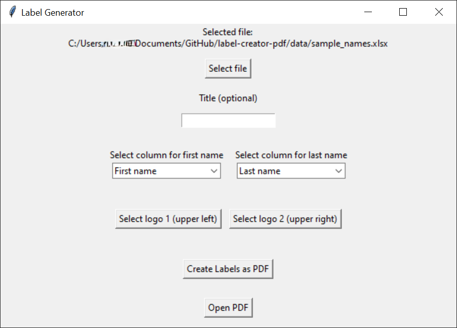

# Label Creator PDF

# About

*Label Creator PDF* is a free tool to create multiple labels on a PDF page. This PDF page can then be printed and cut into pieces for labels.

# Usage

- All you need to provide is an Excel-list with two columns: one for the first and one for the last names. The order is not important as you can assign the column names later to first and last name printed on the label.
- You can also provide a title (e.g., the name of the event) and logos (e.g., your company logo).
- Logo #1 will be printed in the top left corner, logo #2 in the upper right corner.
- After having selected all content, press *Create Labels as PDF* and then *Open PDF* to check the result.
- You can also change the selections and press again the *Create*-button.
- Keep in mind that the Excel-list can't be opened in another program when you use *Label Creator PDF*!
- Have fun and put an issue if you need a fix or enhancement!

 

# Install packages

` pip install -r requirements.txt`

# Run

- You can use the Label Creator with a GUI by executing `python ./src/main.py`.
- You can import the functions for PDF-creation from  `.src/label_creator.py`. E.g. `from label_creator import create_labels` and pass the arguments programmatically `create_labels(names, title, logo_path_1, logo_path_2)`.
- `title`, `logo_path_1` and `logo_path_2` are all optional. If there is no value passed in, the default value is `None`.

# Create executable

## Start clean virtual environment

```bash
python -m venv venv
venv\Scripts\activate
pip install --no-cache-dir pandas openpyxl reportlab
# pip install -r requirements.txt
```

## Build .exe-file

`pyinstaller --clean .\main.spec`